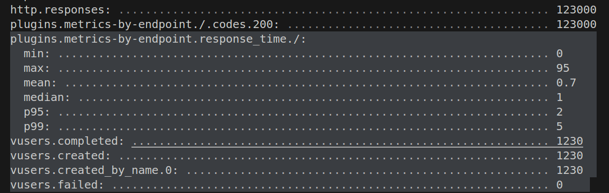
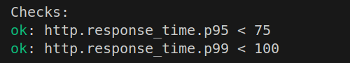

# artillery-load-test

This project is to demo how to use artillery to do load test with nestjs

## dependency

artillery cli

```shell
pnpm add -D artillery
```


## loading test setup

https://www.artillery.io/docs/reference/test-script

use artillery test should setup yaml file

```yaml
config:
  target: http://localhost:3000
  phases:
    - duration: 60
      arrivalRate: 1
      rampTo: 5
      name: Warm up
    - duration: 60
      arrivalRate: 5
      rampTo: 10
      name: Ramp up
    - duration: 30
      arrivalRate: 10
      rampTo: 30
      name: Spike
  plugins:
    ensure: {}
    apdex: {}
    metrics-by-endpoint: {}
  apdex:
    threshold: 100
  ensure:
    thresholds:
      - http.response_time.p99: 100
      - http.response_time.p95: 75
scenarios:
  - flow:
    - loop:
      - get:
          url: '/'
      count: 100
```

run with pnpm

```shell
pnpm artillery run ./artillery.yml
```

## add test script

in package.json **script** field
```json
  "test:artillery": "artillery run ./artillery.yml"
```

with this way, could use ```pnpm run test:artillery``` to run loading test

Report:


check the response time and virtual user criteria

